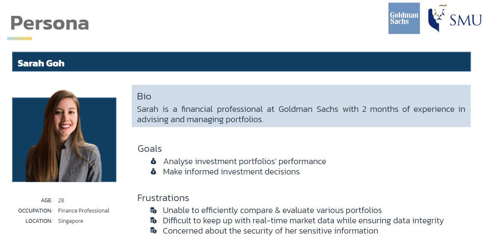

<div align="center">
  
  <p align="center">
    This outlines the project codebase for AY2023/2024 Semester 1 IS442 OOP - G1T5
  </p>
</div>
<br/>

<details>
    <summary>Table of Contents</summary>
    <ol>
        <li>
            <a href="#backend-repository">Backend Repository</a>
        </li>
        <li>
            <a href="#about-the-project">About the Project</a>
        </li>
        <li>
            <a href="#getting-started">Getting Started</a>
            <ul>
                <li>
                    <a href="#prerequisites">Prerequisites</a>
                </li>
                <li>
                    <a href="#usage">Usage</a>
                </li>
            </ul>
        </li>
    </ol>
</details>

## Backend Repository
https://github.com/tanyipeng834/IS442-REST-API 👈

<p align="right">(<a href="#table-of-contents">back to top</a>)</p>

## About the Project
<p style="text-align: justify;">
    Our project's client is <span style="color: #192e47; font-weight: bold">Goldman Sachs</span>, a leading global financial institution. 
    The objective of our application is to aid investment advisors and finance professionals, like <em>Sarah Goh</em>, in analysing investment portfolios' performance and making informed investment decisions.
</p>
<div align="center">
    
</div>
<p align="right">(<a href="#table-of-contents">back to top</a>)</p>


## Getting Started
### Prerequisites
<ul>
    <li>
        <a href="https://nodejs.org/en">Node.js 18.17.1</a>
    </li>
</ul>

### Usage
1. Open the IS442-FRONTEND folder
2. Install required dependencies

```
npm i
```
3. Start frontend

```
npm run serve
```
<p align="right">(<a href="#table-of-contents">back to top</a>)</p>